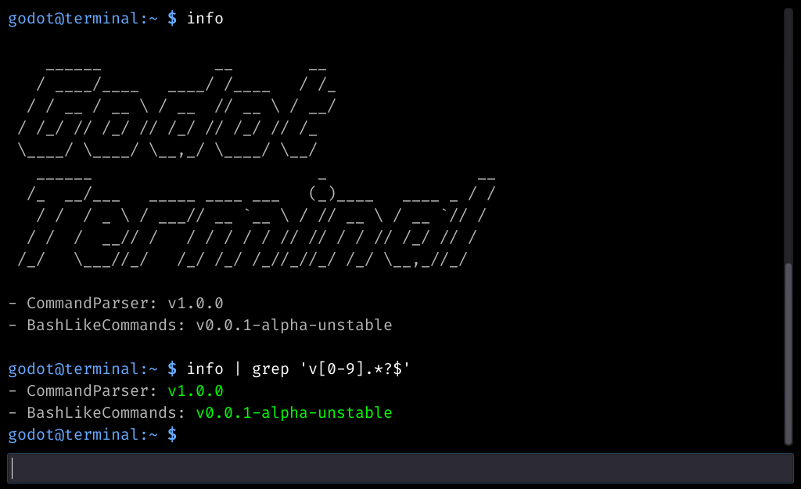
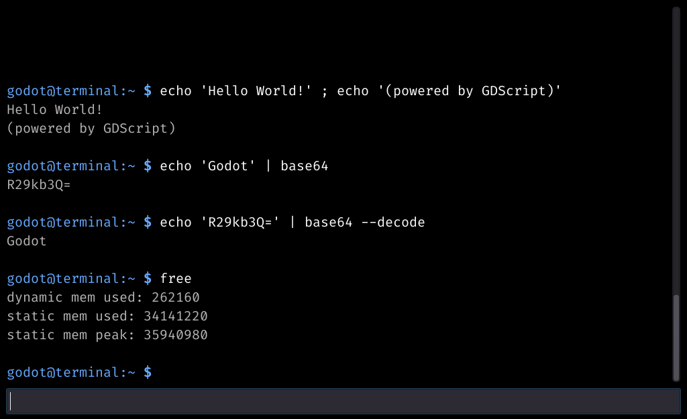

# GD-Tokenizer

A small godot project with a (very simple) tokenizer written in GDScript.

## Screenshots




## Details

This project includes:
- terminal to input bash like commands
- very naive and simple tokenizer
- method to execute the result of the tokenizer

Features:
- string support (double and single quoted)
- bash like commands
- multiple commands in one line (seperator: `;`)
- command piping with `|` (reuse command output as the input for the next command)

What this currently can not do:
- no flow control structures like `if`, `for` or `while`
- no conecpt of subshells

Ther tokenizer is seperated from the execution/parsing. It should be 
relatively easy to implement your own execution method. If you want
to support things like `if`, `for` or `while` you could implement that
in the execution method, there is no need to change the tokenizing method.
You may need to define a few more tokens thought.

## Files

Some important files/directories:

`./cmd`  
`./cmd/BashLikeCommands.gd` _(class that provides a few example bash commands)_  
`./cmd/CommandParser.gd` _(class containing the tokenizer and a method to execute results)_  
`./fonts`  
`./fonts/fira-code` _(directory containing the monospace font I use for the terminal)_  
`./ExampleTerminal.tscn` _(scene with a minimalistic terminal setup)_  
`./ExampleTerminal.gd` _(implements the behaviour of the terminal scene)_  

## Usage

### Minimal Example

```gdscript
extends Node

var parser := CommandParser.new()
var commands := BashLikeCommands.new()

func _ready():

    # Parse and execute one of the bash like commands: echo
    var result := parser.tokenize("echo 'Hello world!'")
    var stdout := parser.execute(result, [self, commands], "%s")
    print(stdout)
    
    # Parse and execute the command 'hello' defined below
    var result := parser.tokenize("hello 'godot'")
    var stdout := parser.execute(result, [self, commands], "%s")
    print(stdout)

func cmd_hello(args: Array, stdin: String):
    if args.size() == 0:
        return "Hello unknown person!"
    elif args.size() == 1:
        return "Hello %s!"
    else:
        return "Error: too many arguments"
```

### Use the tokenizer and executor

The most important file is `./cmd/CommandParser.gd`. This is where the methods
for tokenization and execution are defined.

To use this file you need to create a parser object with `var parser := CommandParser.new()`.

It provides two important methods:

#### `CommandParser.tokenize(input)`

Arguments:
- `input`: String

This method will tokenize your input.

Returns: object of type TokenizedResult

#### `CommandParser.execute()`

Arguments:
- `tr`: TokenResult
- `providers`: Array of Objects
- `err_tpl`: String (where `%s` represents the error)
- `pre`: String

This method takes a TokenizedResult and tries to execute it. You need to provide
a list of command providers and an error template. The template is used to 
format errors, the simplest possible one is `'%s'` (which simply is the error).
A command provider can implement commands by defining methods that start with
`cmd_`. This prefix can be changed with an optional parameter. If you want to use
the bash like commands please add an instance of `BashLikeCommands` to the command
provider list.

# License

All files (except the fonts in `./fonts/fira-code`) are licensed by the MIT License.
Please see the [License File](LICENSE) for more details.

The font used in the Terminal is named "fira-code". Please see the [License File](fonts/fira-code/OFL.txt) for more details.

# Links to other projects

All links in this section point to awesome external projects.
These are not created by me.

- [Godot Engine](https://godotengine.org/)
- [Fira Code Font](https://github.com/tonsky/FiraCode)

## TODO (Add to this readme later)
- how to define your own tokens
- how to write your own executor (maybe?)

